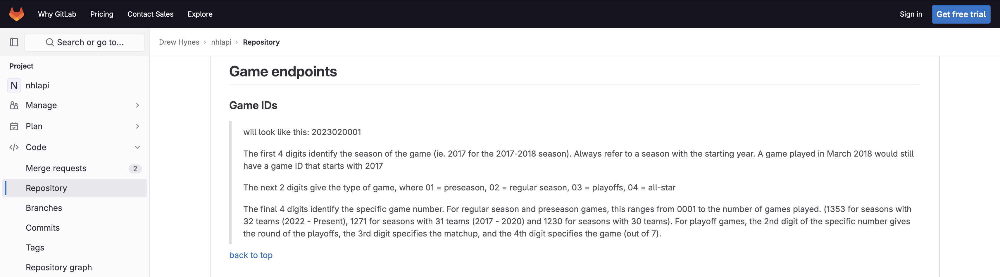
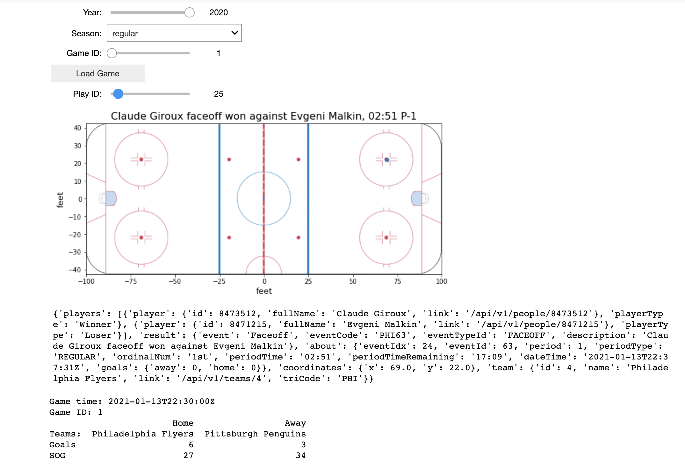
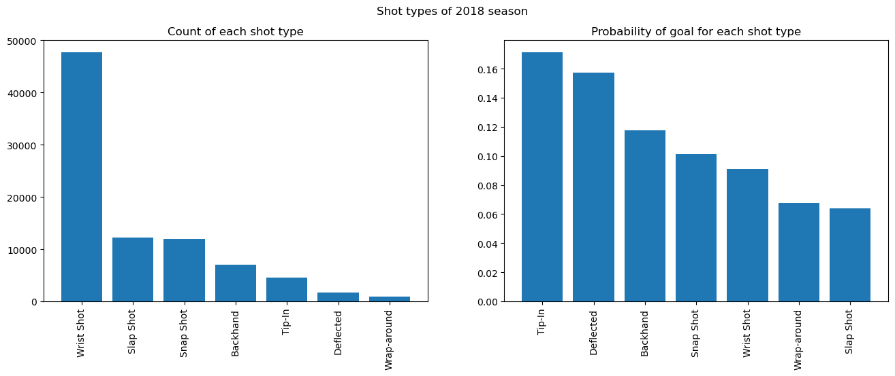
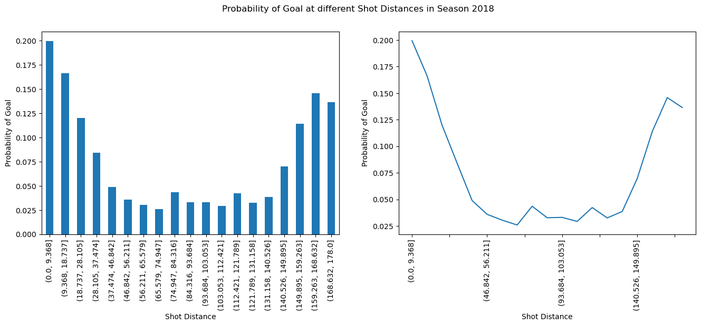
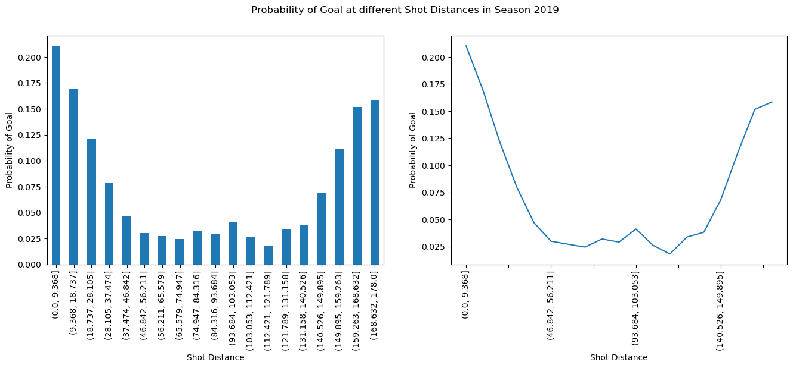
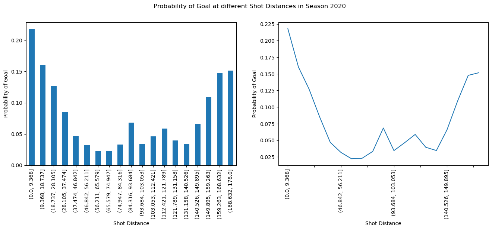
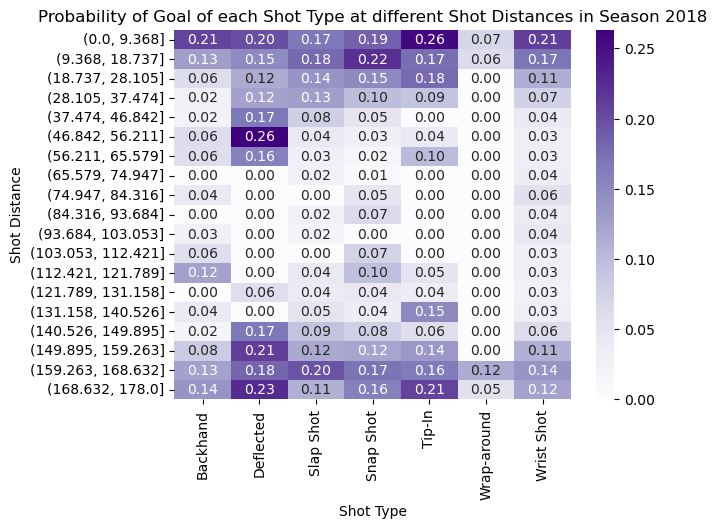

## <strong>1. Data Acquisition</strong>

The play-by-play data was downloaded from the public NHL APIs for Regular season and Playoffs.
The following NHL endpoint was used to download the data:
```markdown
https://statsapi.web.nhl.com/api/v1/game/[GAME_ID]/feed/live/
```
The <strong>GAME_ID</strong> path parameter was constructed for each game in Regular season
and Playoffs from the [unofficial API documentation](https://gitlab.com/dword4/nhlapi/-/blob/master/stats-api.md#game-ids) 
of NHL APIs for all games in seasons from <strong>2016-17</strong> to <strong>2020-21</strong>.



The IDs maintain a specific structure which is as follows:
1. All the IDs consist of 10 digits. 
2. First 4 digits ascertain the season in which the game was played. 
For example, all games played in <strong>2018-19</strong> season will start with <strong>2018</strong>.
3. The next 2 digits ascertain the type of game i.e. whether the game was played in 
<strong>Preseason, Regular season, Playoffs or All Star.</strong>
4. The last 4 digits ascertain the specific game number in the season denoted by
the preceding 2 digits.

For example, the following Python function was used to generate the game IDs.

```python
def get_game_id(self, season: str, game_type: str, game_number: str):
    return f'{season}{game_type}{str(game_number).zfill(4)}'
```

The <strong>game_number</strong> parameter in the above function was constructed a bit 
differently for Regular season and Playoff games.
<br>
<br>
### Regular Season
The ID was fairly straightforward for Regular season games. Here's how it was constructed:
* Get the season in which the game was played (e.g. 2016, 2017, 2018, 2019, 2020).
* Get the corresponding number for the type of game (<strong>'02'</strong> in this case).
* Get the game number which can range from 1 to the total number of games in a given season.

For example, the ID <strong><em>2018020143</em></strong> denotes the game number '143' 
played in 2018 Regular season <em>(Vancouver Canucks vs Arizona Coyotes)</em>.
<br>
<br>
Following Python snippet generates the game ID and obtains the corresponding data for Regular season games:

```python
# Loop in a single hockey season e.g. 2016 (2016-17 season), 2020 (2020-21 season)
for season, games in seasons_to_game_volume_map.items():
    # Loop inside a particular game type i.e. regular or playoffs
    for game_type in game_types:
        # Check the game type. If it is regular then the last 4 digits
        # should be the game number
        if game_type == Gametype.REGULAR.name:
            for game_number in range(1, games + 1):
                game_id = self.get_game_id(season, Gametype.REGULAR.value, str(game_number))
                self.scrape_data(game_id, Gametype.REGULAR.name, loc)
```

### Playoffs
The Playoffs consist of 4 rounds with the 1st round having 8 matchups, 2nd round having 4 matchups,
3rd round having 2 matchups and the final round having 1 matchup.
<br>
<br>
Also, each of the matchups can have 7 games, out of which games 5, 6 and 7 do not necessarily have to be played.
<br>
<br>
Here's how the <strong>game_number</strong> parameter was constructed for Playoff games:
* First 2 digits specify the round (i.e. '01', '02', '03', '04')
* The 3rd digit is the matchup number. It can range from 1 to 8 for round 1, 1 to 4 for round 2, 
1 to 2 for round 3 and 1 for round 4.
* The 4th digit is the game number. For each matchup, it can range from 1 to 7.

For example, the game ID <strong><em>2017030314</em></strong> denotes the 4th game of the 1st matchup in 
the 3rd round of 2017-18 Playoffs <em>(Tampa Bay Lightning vs Washington Capitals)</em>.
<br>
<br>
<em> Note: The first 6 digits of the Playoffs game ID follow the same pattern as the Regular season games.
The only difference is that the number for type of game is <strong>'03'</strong>.</em>

Following Python snippet generates the game ID and obtains the corresponding data for Playoff games:

```python
else:
    total_match_ups = 8
    round_num = 1

    # Continually divide total_match_ups as after each round
    # half of the teams are eliminated
    while total_match_ups != 0:
        for match_up in range(1, total_match_ups + 1):
            for game_number in range(1, 8):
                game_id = self.get_game_id(season, Gametype.PLAYOFFS.value,
                                           f'{str(round_num).zfill(2)}{match_up}{game_number}')
                self.scrape_data(game_id, Gametype.PLAYOFFS.name, loc)
        total_match_ups = total_match_ups // 2
        round_num += 1
```

The class <strong><em>scrape_nhl_data</em></strong> does the work of downloading all the data. Following
is the code for the same:
 ```python
class scrape_nhl_data:
    def get_game_id(self, season: str, game_type: str, game_number: str):
        return f'{season}{game_type}{str(game_number).zfill(4)}'

    def write_data(self, loc: str, season: str, content: Union[SupportsIndex, slice]):
        if season != Gametype.REGULAR.name and 'endDateTime' not in content['gameData']['datetime']:
            return
        with open(f'{loc}.json', 'w+', encoding='utf-8') as f:
            json.dump(content, f, ensure_ascii=False, indent=4)

    def scrape_data(self, game_id, game_type, path):
        endpoint = f'https://statsapi.web.nhl.com/api/v1/game/{game_id}/feed/live/'
        try:
            time.sleep(0.5)
            res = req.get(endpoint)
            res.raise_for_status()
            self.write_data(f'{path}/{game_id}', game_type, res.json())
        except req.exceptions.HTTPError as err:
            print(f'API failed for {game_id} with status code {err.response.status_code}')
        except Exception as e:
            print(f'{game_type} trace: {endpoint} {game_id}')
            print(e)

    def get_play_by_play_data(self,
                              path: str,
                              seasons_to_game_volume_map: dict,
                              game_types: list
                              ):
        """Creates folders for each game type in a season and stores the play-by-play data for
        each game in a json file
                Arguments:
                    path (str): Location where the files should be created.
                    Ideally it should be the 'data' folder of our repository.

                    Note: Do not precede the path with a '/'. If the data
                    needs to be saved in the same directory as this script then
                    pass an empty string ''.

                    seasons_to_game_volume_map (dict of str: int): Map of seasons
                    for which the data is required and the corresponding number of
                    games in that season. For e.g. it will have the key as '2016'
                    for the 2016-17 season and 1230 as the corresponding number of games.

                    game_types (dict of str: str): List of game types for which
                    data needs to be retrieved.

                Return:
                    Folder containing data for each hockey season. These folders in
                    turn contain play-by-play data for regular and playoff games.
        """
        # Loop in a single hockey season e.g. 2016 (2016-17 season), 2020 (2020-21 season)
        for season, games in seasons_to_game_volume_map.items():
            # Loop inside a particular game type i.e. regular or playoffs
            for game_type in game_types:
                if len(path.strip()) == 0:
                    loc = f'{season}/{game_type}'
                else:
                    loc = f'{path}/{season}/{game_type}'

                if not os.path.exists(loc):
                    os.makedirs(loc)

                # Check the game type. If it is regular then the last 4 digits
                # should be the game number
                if game_type == Gametype.REGULAR.name:
                    for game_number in range(1, games + 1):
                        game_id = self.get_game_id(season, Gametype.REGULAR.value, str(game_number))
                        self.scrape_data(game_id, Gametype.REGULAR.name, loc)

                # Otherwise, game_type == 'playoff' and the last 4 digits
                # should be composed as follows:
                # first 2 digits -> round number (can be 01, 02, 03, 04)
                # third digit -> match up (can be upto 8, 4, 2, 1 for
                # the above mentioned round numbers)
                # fourth digit -> game number (can be from 1 to 7)
                else:
                    total_match_ups = 8
                    round_num = 1

                    # Continually divide total_match_ups as after each round
                    # half of the teams are eliminated
                    while total_match_ups != 0:
                        for match_up in range(1, total_match_ups + 1):
                            for game_number in range(1, 8):
                                game_id = self.get_game_id(season, Gametype.PLAYOFFS.value,
                                                           f'{str(round_num).zfill(2)}{match_up}{game_number}')
                                self.scrape_data(game_id, Gametype.PLAYOFFS.name, loc)
                        total_match_ups = total_match_ups // 2
                        round_num += 1
```

The function <strong><em>get_play_by_play_data</em></strong> needs to be called with the download path, seasons and their corresponding
number of games and the game types for which the data is to be downloaded.
<br>
<br>
Here is an example of how this function can be called:

```python
from make_dataset import Gametype, scrape_nhl_data

scraper = scrape_nhl_data()
season_data = {'2016': 1230, '2017': 1271, '2018': 1271,'2019': 1271,'2020': 868}
game_types = [Gametype.REGULAR.name, Gametype.PLAYOFFS.name]
data = scraper.get_play_by_play_data(path='', seasons_to_game_volume_map=season_data,game_types=game_types)
```
<br><br><br>
## <strong>2. Interactive Debugging Tool</strong>
<strong>Question 1</strong>

The tool allows the user to dynamically obtain data about a game (ex: points scored, shots on goals) which are outputted in tabular form by specifying the <strong>year</strong>, <strong>season</strong>, and <strong>game ID</strong>. Once the game is selected, the user may scroll through all plays throughout the game which the code dynamically visualizes with a map of the ice rink and details of the play (ex: nature of the play/event, period, players involved and their teams), which notably include the coordinates of the event. Underneath this visual aid, the full play data is outputted in text form for the user. See image and code below of our team's implementation of this interactive tool.



```python
def load_data(path, year, season, game_ID):
    
    data_path = f"{path}/{year}/{season}/"
    files = sorted(glob.glob(data_path+'*.json'), key=lambda x: int(re.search(r'(\d+).json', x).group(1)))
    _, filename = os.path.split(files[game_ID-1])

    with open(os.path.join(data_path, filename), 'r') as file:
        game_data = json.load(file)
    
    gameTime = game_data['gameData']['datetime']['dateTime']
    homeTeam = game_data['gameData']['teams']['home']['name']
    awayTeam = game_data['gameData']['teams']['away']['name']
    liveData = game_data['liveData']['linescore']['periods']
    num_periods = len(liveData)
    home_SoG = np.sum([liveData[i]['home']['shotsOnGoal'] for i in range(num_periods)])
    home_goals = np.sum([liveData[i]['home']['goals'] for i in range(num_periods)])
    away_SoG = np.sum([liveData[i]['away']['shotsOnGoal'] for i in range(num_periods)])
    away_goals = np.sum([liveData[i]['away']['goals'] for i in range(num_periods)])
    
    d = {'Home': [homeTeam, home_goals, home_SoG], 'Away': [awayTeam, away_goals, away_SoG]}
    df = pd.DataFrame(data=d, index = ['Teams:', 'Goals', 'SOG'])
    
    print('Game time: '+ gameTime)
    print('Game ID: '+ str(game_ID))
    print(df)
    
    return game_data

# Initializing widgets
year_slider = widgets.IntSlider(
                value=2022, 
                min=2016, 
                max=2020, 
                step=1, 
                description='Year:')

season_dropdown = widgets.Dropdown(
                options=['regular', 'playoffs'], 
                value='regular', 
                description='Season:')

game_slider = widgets.IntSlider(
                value=1,
                min=1, 
                max=1, 
                step=1, 
                description='Game ID:')

load_button = widgets.Button(description="Load Game")

play_slider = widgets.IntSlider(
                value=1,
                min=1, 
                max=1, 
                step=1, 
                description='Play ID:')

def year_slider_updated(IntSlideValue):
    year = IntSlideValue.new
    if hasattr(season_dropdown, 'value'):
        season = season_dropdown.value
        data_path = f"data/{year}/{season}/"
        num_games = len(os.listdir(data_path))
        game_slider.max = num_games
        game_slider.value = 1

def season_dropdown_updated(IntSlideValue):
    if hasattr(year_slider, 'value'):
        season = IntSlideValue.new
        year = year_slider.value
        data_path = f"data/{year}/{season}/"
        num_games = len(os.listdir(data_path))
        game_slider.max = num_games
        game_slider.value = 1

def game_slider_updated(IntSlideValue):
    game_number = IntSlideValue.new
    year = year_slider.value
    season = season_dropdown.value
    data_path = f"data/{year}/{season}/"

def load_button_click(IntSlideValue):
    year = year_slider.value
    season = season_dropdown.value
    game_id = game_slider.value
    global data
    data = load_data(DATA_PATH,year, season, game_id)
    num_plays = len(data['liveData']['plays']['allPlays'])
    play_slider.max = num_plays
    play_slider.value = 1

output_widget = Output()

def play_slider_change(IntSlideValue):
    play_id = IntSlideValue.new
    
    with output_widget:
        output_widget.clear_output(wait=True) 
        
        play = data['liveData']['plays']['allPlays'][play_id - 1]
        play_coordinates = play['coordinates']
        play_description = play['result']['description']
        period = play['about']['period']
        periodTime = play['about']['periodTime']
        
        homeTeam_triCode = data['gameData']['teams']['home']['triCode']
        awayTeam_triCode = data['gameData']['teams']['away']['triCode']
        
        img = mpimg.imread('https://raw.githubusercontent.com/udem-ift6758/project-template/main/figures/nhl_rink.png')
        
        plt.figure(figsize=(10, 8))
        plt.imshow(img, extent = [-100, 100, -42.5, 42.5])
        if len(play_coordinates) > 0:
            plt.scatter(play_coordinates['x'], play_coordinates['y'], s = 30)
        plt.axis()
        plt.title(play_description+f', {periodTime} P-{period}', fontsize = 16)
        plt.xlabel('feet', fontsize = 13)
        plt.ylabel('feet', fontsize = 13)
        plt.show()
        
        print(play)
    
year_slider.observe(year_slider_updated, names='value')
game_slider.observe(game_slider_updated, names='value')
season_dropdown.observe(season_dropdown_updated, names='value')
load_button.on_click(load_button_click)
play_slider.observe(play_slider_change, names='value')

widget_container = widgets.VBox([year_slider, season_dropdown, game_slider, load_button, play_slider])
display(widgets.VBox([widget_container, output_widget]))
```
<br><br><br>
## <strong>4. Tidy Data</strong>

<strong>Question 1</strong>: Here is an example of the dataframe outputted for game ID 2017021050 which occurred on 2018-03-10 between MTL and TBL.

|    game_id | homeTeam   | awayTeam   | periodType   |   period | periodTime   | team   | eventType   |   x coordinate |   y coordinate | goal_location   | shooter             | goalie         | shotType   | emptyNet   | strength   |
|-----------:|:-----------|:-----------|:-------------|---------:|:-------------|:-------|:------------|---------------:|---------------:|:----------------|:--------------------|:---------------|:-----------|:-----------|:-----------|
| 2017021050 | TBL        | MTL        | REGULAR      |        1 | 00:15        | TBL    | Shot        |             47 |            -25 | Left            | Dan Girardi         | Antti Niemi    | Wrist Shot |            |            |
| 2017021050 | TBL        | MTL        | REGULAR      |        1 | 00:35        | MTL    | Shot        |            -54 |             -3 | Right           | Andrew Shaw         | Louis Domingue | Wrist Shot |            |            |
| 2017021050 | TBL        | MTL        | REGULAR      |        1 | 04:10        | MTL    | Goal        |            -62 |             14 | Right           | Artturi Lehkonen    | Louis Domingue | Slap Shot  | False      | PPG        |
| 2017021050 | TBL        | MTL        | REGULAR      |        1 | 05:50        | MTL    | Shot        |            -62 |             11 | Right           | Alex Galchenyuk     | Louis Domingue | Wrist Shot |            |            |
| 2017021050 | TBL        | MTL        | REGULAR      |        1 | 08:17        | MTL    | Shot        |            -58 |            -19 | Right           | Nicolas Deslauriers | Louis Domingue | Wrist Shot |            |            |
| 2017021050 | TBL        | MTL        | REGULAR      |        1 | 08:48        | TBL    | Shot        |             60 |              0 | Left            | Brayden Point       | Antti Niemi    | Wrist Shot |            |            |
| 2017021050 | TBL        | MTL        | REGULAR      |        1 | 09:21        | MTL    | Shot        |            -67 |            -12 | Right           | Alex Galchenyuk     | Louis Domingue | Snap Shot  |            |            |
| 2017021050 | TBL        | MTL        | REGULAR      |        1 | 11:04        | TBL    | Shot        |             38 |             28 | Left            | Victor Hedman       | Antti Niemi    | Wrist Shot |            |            |
| 2017021050 | TBL        | MTL        | REGULAR      |        1 | 11:31        | TBL    | Shot        |             58 |             10 | Left            | Brayden Point       | Antti Niemi    | Wrist Shot |            |            |
| 2017021050 | TBL        | MTL        | REGULAR      |        1 | 12:14        | MTL    | Shot        |            -80 |             -2 | Right           | Charles Hudon       | Louis Domingue | Wrist Shot |            |            |

<strong>Question 2</strong>: We can keep track of penalty events by capturing crucial details like the players involved, their team, and the duration of the penalty stored in the event's JSON object. This allows us to maintain a record of active penalties and dynamically update the number of players on the ice, subtracting those in the penalty box from the standard 5, within the specified time interval. In doing so, we determine the details (ex: 5 on 4) of each powerplay.

<strong>Question 3</strong>: We could keep track of the face-offs, capturing valuable statistics not only throughout a single game, but also enabling us to keep track of players’ ability to win face-offs and track their progress throughout a season. Furthermore, we can compile data on missed shots and goals, along with respective player information, allowing us to generate a dataset enabling us to compute key metrics like the missed-to-successful goals ratio throughout the entire season.

<br><br><br>
## <strong>5. Simple Visualization</strong>

<strong>Question 1</strong>: Here we chose 2018 as the season, outputting the count of all the shot types and the shot types which gained goals. We can see from the first plot that the most common shot type is the <strong>'Wrist shot'</strong>, because it counts the most. And from the second the most dangerous shot type is the <strong>'Tip-in'</strong> because it is the shot type with the highest probability of scoring.



<strong>Question 2</strong>: In this section we divide the maximum shot distance to the goal in the direction of attack (determined by the home and away stadiums of the teams) into 20 intervals, and for each interval the number of shots and the number of points scored are counted, and the probability of scoring a goal in each interval is computed and represented in the form of a bar chart as well as a linear graph.<br>





From the three images, we can see that the relationship between shooting distance and scoring chances roughly shows a U-shaped curve with two high ends and a low middle. That is, the probability of scoring is highest when the shot is closest to the goal, then decreases gradually as the distance increases, and then the curve bounces back after it reaches the lowest point, and the probability of scoring gradually increases as the distance increases. The relationship has not seen a great deal of change over the three seasons and has largely followed this pattern.

<strong>Question 3</strong>: In this section, we had intended to follow the bar chart format of the previous section and generate a percentage stacked bar chart by dividing the probability of scoring in each interval by the percentage of different shot types. However, this would only give a rough idea of the relationship between the percentage of different shots in each interval, which is not very intuitive and not conducive to useful conclusions. So we calculated the probability of scoring for different shot types in each interval separately, and used this to generate a heat map.



From the heat map, we can easily see that the shot type <strong>'Deflected'</strong> has a good probability of scoring in most of the shot distance intervals, so we consider this shot type to be the one that poses the greatest threat to the enemy team, i.e., the most dangerous shot type.