# <strong>DATA PATH RULES</strong>
## To run the code correctly, please follow the instructions below:  
Rename the data folder to 'IFT6758_Data' and place the folder under the main(father) path  
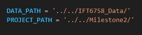 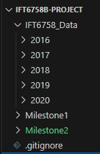 

## <strong>1. Experiment Tracking</strong>

### TBD

### See the following parts.

## <strong>2. Feature Engineering I</strong>

### In this milestone, we split the raw data into train, validation and test sets:

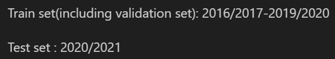

### <strong>Question 1</strong>: 

Here we have calculated shot_distance and shot_angle and added them as new columns to the dataframe. And set the number of bins to 20 for plot. 
As we can see from the chart, although the number of no-goals is significantly higher than the number of goals, the two roughly follow an approximate distribution.

From the image we can see that the distribution roughly shows a U-shaped distribution with a low centre and two high ends. From the distribution we can guess that due to the large number of people gathered in the middle of the field during the game, it might be difficult to score from this distance, so most of the time the athletes did not perform the shooting action at this distance.

From the image we can see that shot counts show a decreasing trend with increasing angle. This indicates that most of the athletes tend to shoot from the front rather than from a more oblique angle.

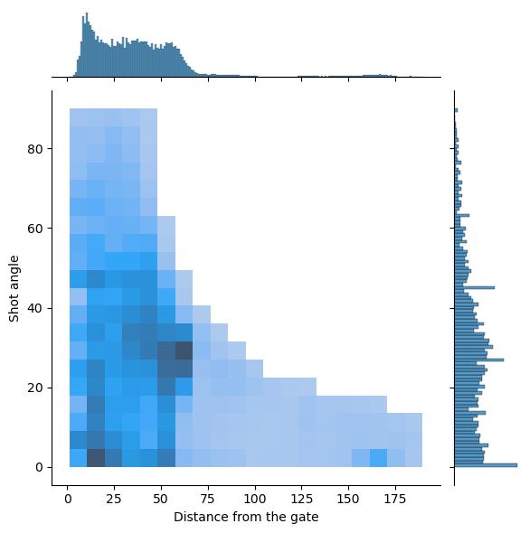

From the image we can see that the shot counts have a significant density when the distance is far and the angle is close to 0. From this we can guess that many fast counterattacks (i.e. shots on the opponent's net in front of their own net) took place in the actual match.

### <strong>Question 2</strong>:

In this question instead of histograms, we chose bar charts for plotting. Because for continuous data, the probability of goal at each distance point (or angle point) will only be 1 or 0, the data we get in this case is not meaningful for any study. So we divided the distances and angles into 20 intervals and calculated the goal rate for each interval separately. The results are as follows:

From the image we can see that the distribution roughly shows a U-shaped distribution with a low centre and two high ends. The higher goal rate at closer distances is very understandable, and the lower goal-scoring rate at mid-distance somehow confirms our suspicion in question 1 that there is a large number of players gathered in the middle of the court, which makes it less easy to goal. The high goal rate at longer distances may be due to quick counter-attacks, where the opposing players have no time to react.

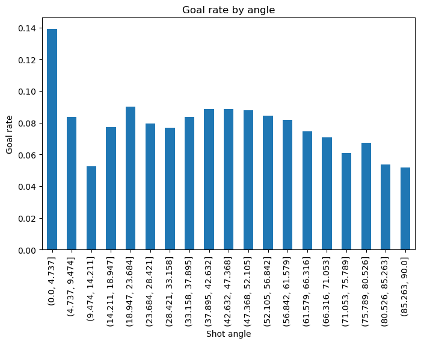

From the image we can see that the goal rate is higher when the angle is close to 0, while the other angles have roughly the same goal rate. This is also aligned with our common sense: shots from the front are more likely to goal.

### <strong>Question 3</strong>:

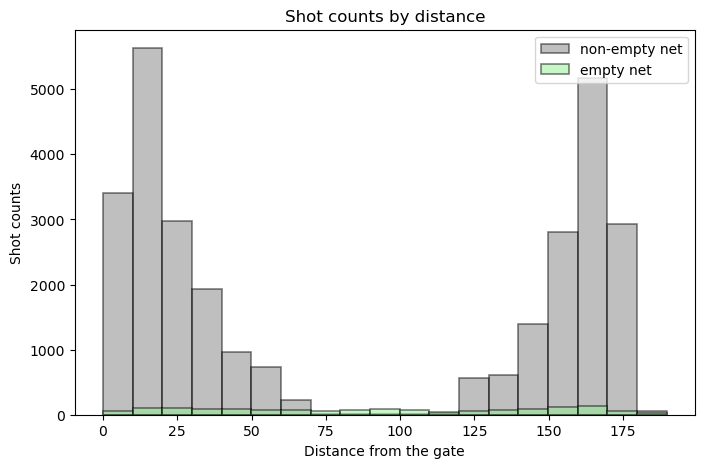

From the image we can see that the empty net stays at a very low level no matter what the shot distance is. This shows that in most cases the goalkeepers of both teams stay in front of their own net. 
Our domain knowledge is that "it is incredibly rare to score a non-empty net goal on the opposing team from within your defensive zone". But from the image we can see that there are very many non-empty net goals scored from long distance, which is against our domain knowledge and suggests that there may be anomalous data.

## <strong>3. Baseline Models</strong>

### <strong>Question 1</strong>:

### <strong>Question 2</strong>:

### <strong>Question 3</strong>:

### <strong>Question 4</strong>:

## Feature Engineering II: Question 4

The following are feature names outputted by `feature_eng2_cleaned` (i.e., our feature engineering function provided in `Milestone2/features/feature_eng2.py`) with their respective descriptions:

 <strong>gameSeconds (`int`):</strong> value of number of seconds into the game   
 <strong>period (`int`):</strong> value of the period number (ex: `period = 3` for P-3)  
 <strong>x_coordinate(`float`):</strong> x coordinate of the event in feet  
 <strong>y_coordinate (`float`):</strong> y coordinate of the event in feet   
 <strong>shotDistance (`float`):</strong> distance between the event and the net   
 <strong>shotAngle (`float`):</strong> counter-clockwise angle (in degrees) between the event and the goal with respect to the x-axis   
 <strong>shotType (`str`):</strong> type of shot (ex: Wrist Shot, Slap Shot)   
 <strong>LastEventType (`str`):</strong> previous event type (ex: Shot, Goal)   
 <strong>Last_x_coordinate (`float`):</strong> x coordinate of the previous event in feet  
 <strong>Last_y_coordinate (`float`):</strong> y coordinate of the previous event in feet  
 <strong>timeFromLastEvent (`float`):</strong> time interval in seconds between the current and previous event   
 <strong>DistanceLastEvent (`float`):</strong> distance in feet between the current and previous event   
 <strong>Rebound (`bool`):</strong> boolean value for if the shot was a rebound (`True/1`) or not (`False/0`)  
 <strong>changeShotAngle (`bool`):</strong> if `Rebound = True/1`, change in the angle of the puck before and after the rebound   
 <strong>speed (`float`):</strong> speed between current and previous event corresponding to DistanceLastEvent/timeFromLastEvent in ft/s  
 <strong>time_since_pp (`float`):</strong> BONUS feature corresponding to the time in seconds since the currently active power-play started  
<strong>no_players_home (`int`):</strong> BONUS feature corresponding to the number of home team non-goalie players current on the ice  
 <strong>no_players_away (`int`):</strong> BONUS feature corresponding to the number of away team non-goalie players current on the ice  
 <strong>is_goal (`bool`):</strong> boolean value where 0 corresponds to a shot (<strong>not</strong> goal), while 1 corresponds to a goal.

## Feature Engineering II: Question 4 (bonus)

We've computed the time (s) since the power-play (PP) started for all penalties (both teams included), for home team penalties, and for away team penalties as a function of period time (in seconds). See the following plots below for the game ID 2016020031 of regular season in 2016 during period 3. Naturally, the y-value (time since PP start) increases as the periodTime increases. Also, the combination of the time since PP start for home team penalties and away team penalties also corresponds to the plot for the time since PP started for all penalties (both teams included). 

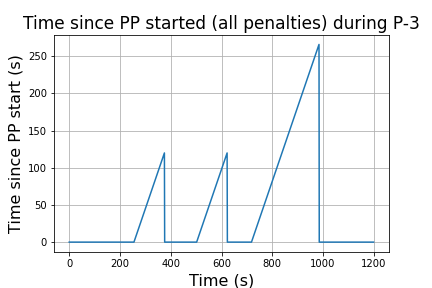
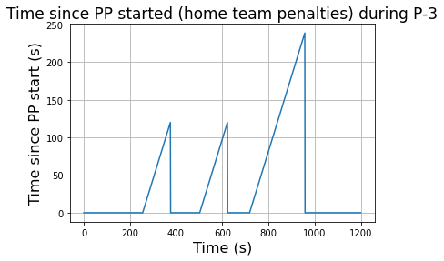
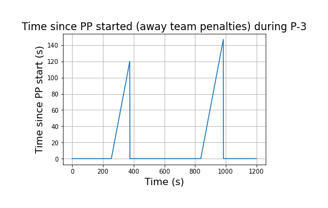

Moreover, we've determined the number of friendly non-goalie (home team) skaters on the ice as well as the number of opposing non-goalie skaters (away team) on the ice as a function of period time (s). The function generating the data plotted takes as input the game data `pd.Dataframe` as well as the period number `select_period`. See the following plots below for the game ID 2016020031 of regular season in 2016 during period 3:

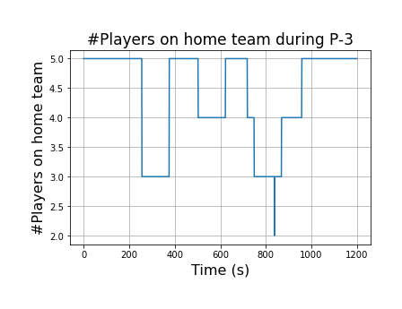
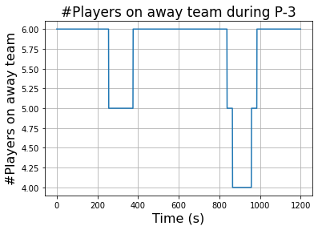

## <strong>5. Advanced Models</strong>

### <strong>Question 1</strong>:

### <strong>Question 2</strong>:

### <strong>Question 3</strong>:

## <strong>6. Give it your best shot!</strong>

### <strong>Question 1</strong>:

### <strong>Question 2</strong>:

## <strong>7. Evaluate on test set</strong>

### <strong>Question 1</strong>:

### <strong>Question 2</strong>: