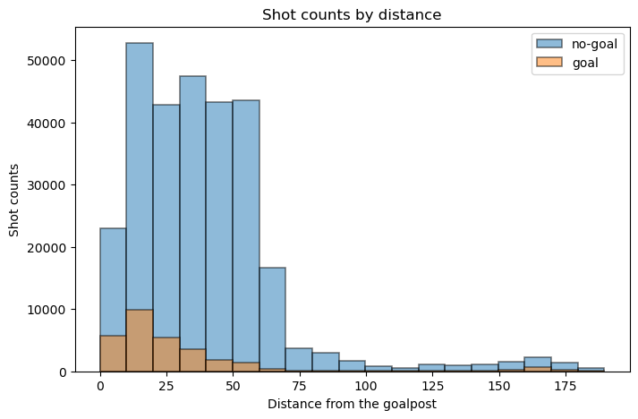

# <strong>DATA PATH RULES</strong>
## To run the code correctly, please follow the instructions below:  
Rename the data folder to 'IFT6758_Data' and place the folder under the main(father) path  
  

## <strong>1. Experiment Tracking</strong>

### See the following parts.

## <strong>2. Feature Engineering I</strong>

### In this milestone, we split the raw data into train, validation and test sets:

### <strong>Question 1</strong>: 

Here we have calculated shot_distance and shot_angle and added them as new columns to the dataframe. And set the number of bins to 20 for plot. 
As we can see from the chart, although the number of no-goals is significantly higher than the number of goals, the two roughly follow an approximate distribution.

From the image we can see that the distribution roughly shows a U-shaped distribution with a low centre and two high ends. From the distribution we can guess that due to the large number of people gathered in the middle of the field during the game, it might be difficult to score from this distance, so most of the time the athletes did not perform the shooting action at this distance.

From the image we can see that shot counts show a decreasing trend with increasing angle. This indicates that most of the athletes tend to shoot from the front rather than from a more oblique angle.

From the image we can see that the shot counts have a significant density when the distance is far and the angle is close to 0. From this we can guess that many fast counterattacks (i.e. shots on the opponent's net in front of their own net) took place in the actual match.

### <strong>Question 2</strong>:

In this question instead of histograms, we chose bar charts for plotting. Because for continuous data, the probability of goal at each distance point (or angle point) will only be 1 or 0, the data we get in this case is not meaningful for any study. So we divided the distances and angles into 20 intervals and calculated the goal rate for each interval separately. The results are as follows:

From the image we can see that the distribution roughly shows a U-shaped distribution with a low centre and two high ends. The higher goal rate at closer distances is very understandable, and the lower goal-scoring rate at mid-distance somehow confirms our suspicion in question 1 that there is a large number of players gathered in the middle of the court, which makes it less easy to goal. The high goal rate at longer distances may be due to quick counter-attacks, where the opposing players have no time to react.

From the image we can see that the goal rate is higher when the angle is close to 0, while the other angles have roughly the same goal rate. This is also aligned with our common sense: shots from the front are more likely to goal.

### <strong>Question 3</strong>:

From the image we can see that the empty net stays at a very low level no matter what the shot distance is. This shows that in most cases the goalkeepers of both teams stay in front of their own net. 
Our domain knowledge is that "it is incredibly rare to score a non-empty net goal on the opposing team from within your defensive zone". But from the image we can see that there are very many non-empty net goals scored from long distance, which is against our domain knowledge and suggests that there may be anomalous data.

## <strong>3. Baseline Models</strong>

### <strong>Question 1</strong>:
 
The accuracy score of our model on the validation set is approximately 0.906, which means that it correctly predicted about 90.6% of the samples in the validation set.Accuracy is a useful metric when the classes are balanced, but it can be misleading when the class distribution is inbalance.I calculate it by comparing the model's predictions against the actual outcomes in the validation set. It's the number of correct predictions divided by the total number of predictions. 
in summary even  though the accuracy is high in the model but the classifier doesnt work well as our classes are inbalance. this might be due to the feutures that we chosed. goals are not correlated with the distance of the shot from net. 

### <strong>Question 2</strong>: 
 
The first plot labeled "ROC curve for distance"shows the performance of my classifier in terms of the trade-off between the true positive rate and false positive rate. The area under the curve (AUC) is 0.53, which is slightly better than random guessing (AUC of 0.5). However, an AUC this close to 0.5 indicates that the model does not have a strong discriminatory ability. 
 
The goal rate (#goals / (#no_goals + #goals)) as a function of the shot probability model percentile, i.e. if a value is the 70th percentile, it is above 70% of the data.  
 
third plot is cumulative percentage of goals, which is an empirical cumulative distribution function (ECDF) of the predicted probabilities for the goals. This can help understand the concentration of goals within certain predicted probability ranges. 
 
 is a calibration curve, it show how well the predicted probabilities of the goals are calibrated. The ideal calibration curve would be a straight line at a 45-degree angle. Deviations from this line indicate over- or under-confidence in predictions. if the model is perfectly calibrated, the predicted probabilities of the positive class would match the actual frequency of the positive class.
### <strong>Question 3</strong>:
 
models trained using distance from net (distance from net alone or both distance and angle) performed better than those trained using angle from net alone. Models trained on distance tend more towards the top left corner on the ROC plot than do models using angle only, and they have an AUC of 0.65 compared to an AUC of 0.51 for angle. Combining distance and angle adds no increased AUC or curve, suggesting that distance is the defining feature. Indeed, the model using angle only has an AUC matching that of the random baseline. The fact that the ROC curves for angle and random baseline are different despite them having the same AUC values highlights the need to look at data in different ways - in this case, it suggests that the model trained on angle is not simply choosing at random. 
 
This plot shows the goal rates at different shot probability model percentiles. Plotting goal rate as a function of shot probability model percentile gives an indication of whether the model favours shots of a certain probability and hints at what the model thinks is a high-quality shot. The random baseline (Figure 3.3.2), as a straight horizonal line at 10% on the goal rate, gives equal weight to goals of all probabilities. The logistic regression model trained on angle gives a higher goal rate to shots around the 50th model percentile and underweights (assigns a lower goal rate to) shots with high or low model percentiles. Similar to the ROC curves, we see that models using distance from net alone and distance + angle have near-identical curves. Both of these models assign a higher-than-baseline goal rate to shots in the upper model percentile (~ > 70 %) and lower-than-baseline to shots in the lower model percentile (except for shots < 5 %), suggesting that they attribute a higher quality to shots in the upper model percentile.
 
 
The cumulative percentage of goals plot shows how well the models rank the shots by their probability of being a goal. Ideally, a higher proportion of actual goals would be found at higher predicted probabilities.
The model using both features again seems to perform better than the others, as it ranks more goals at higher probability percentiles, but the improvement over the single-feature models is not dramatic. 
 
A well-calibrated model should have points that lie close to the "perfectly calibrated" line, where the predicted probabilities match the observed frequencies.
The calibration plot shows that Distance, Angle and Distance-angle are calibrated while the random baseline is poorly calibrated, with most predictions clustered at the low probability end and not aligning with the diagonal line representing perfect calibration.distance-angle is passing the perfect line to the point that we can consider over fitting.but we can assume that feature selectioon play a important role in model calibration.
To improve the model, it may be necessary to explore more complex models, additional features, or different data preprocessing techniques.
### <strong>Question 4</strong>:
 distance: https://www.comet.com/api/registry/model/item/download?modelItemId=NNWWTsrccam0dBkAcTD6tY43f 
 angle: https://www.comet.com/api/registry/model/item/download?modelItemId=mtVkSF73afL3TmKZM9VDKXqbP 
 distance-angle: https://www.comet.com/api/registry/model/item/download?modelItemId=RmkwRg4fFcR9QHAXOde2xh3G6 
## <strong>4. Feature Engineering II</strong>

### <strong>Question 1</strong>:

### <strong>Question 2</strong>:

### <strong>Question 3</strong>:

### <strong>Question 4</strong>:

### <strong>Question 5</strong>:

## <strong>5. Advanced Models</strong>

### <strong>Question 1</strong>:

### <strong>Question 2</strong>:

### <strong>Question 3</strong>:

## <strong>6. Give it your best shot!</strong>

### <strong>Question 1</strong>:

### <strong>Question 2</strong>:

## <strong>7. Evaluate on test set</strong>

### <strong>Question 1</strong>:
### <strong>Question 2</strong>:
