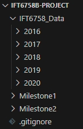

# <strong>DATA PATH RULES</strong>
## To run the code correctly, please follow the instructions below:  
Rename the data folder to 'IFT6758_Data' and place the folder under the main(father) path  
  

## <strong>1. Experiment Tracking</strong>

### See the following parts.

## <strong>2. Feature Engineering I</strong>

### In this milestone, we split the raw data into train, validation and test sets:

### <strong>Question 1</strong>: 

Here we have calculated shot_distance and shot_angle and added them as new columns to the dataframe. And set the number of bins to 20 for plot. 
As we can see from the chart, although the number of no-goals is significantly higher than the number of goals, the two roughly follow an approximate distribution.

From the graph we can see that shot counts are high at [0,50] but decrease when the distance increases. This is very understandable, because the closer the distance, the easier it is to goal. But the shot counts are also lower at [0,10], due to the fact that it's too close to the goalpost, and has probably been intercepted by an opposing player before that.

From the image we can see that shot counts show a decreasing trend with increasing angle. This indicates that most of the athletes tend to shoot from the front rather than from a more oblique angle. This is also in line with our common sense: more oblique angles tend to be harder to get a goal.

From the image we can see that the shot counts have a significant density when the distance is close and the angle is close to 0. This is also in line with common sense: shots tend to be concentrated closer to the front of the net.

### <strong>Question 2</strong>:

In this question instead of histograms, we chose bar charts for plotting. Because for continuous data, the probability of goal at each distance point (or angle point) will only be 1 or 0, the data we get in this case is not meaningful for any study. So we divided the distances and angles into 20 intervals and calculated the goal rate for each interval separately. The results are as follows:

We can see from the graph that the distribution is roughly "U" shaped with a low centre and high ends. The higher goal rate from close range is well understood, whereas the lower goal rate from mid-range may be due to a large number of players congregating in the centre of the pitch, which makes scoring goals less easy. The high rate of goals from further distances may be due to quick counter-attacks where the opposing players have no time to react.

From the image we can see that the goal rate is higher when the angle is close to 0, while the other angles have roughly the same goal rate. This is also aligned with our common sense: shots from the front are more likely to goal.

### <strong>Question 3</strong>:

From the image we can see that the empty net stays at a very low level no matter what the shot distance is. This shows that in most cases the goalkeepers of both teams stay in front of their own net. 
According to our domain knowledge, "it is very rare to score a non-open goal to an opposing team in their own defensive zone". However, we can see from the picture that there are some non-empty long range goals in the [150,175] zone, which contradicts our domain knowledge and suggests that there may be anomalous data.

## <strong>3. Baseline Models</strong>

### <strong>Question 1</strong>:

### <strong>Question 2</strong>:

### <strong>Question 3</strong>:

### <strong>Question 4</strong>:

## <strong>4. Feature Engineering II</strong>

### <strong>Question 1</strong>:

### <strong>Question 2</strong>:

### <strong>Question 3</strong>:

### <strong>Question 4</strong>:

### <strong>Question 5</strong>:

## <strong>5. Advanced Models</strong>

### <strong>Question 1</strong>:

### <strong>Question 2</strong>:

### <strong>Question 3</strong>:

## <strong>6. Give it your best shot!</strong>

### <strong>Question 1</strong>:

### <strong>Question 2</strong>:

## <strong>7. Evaluate on test set</strong>

### <strong>Question 1</strong>:

### <strong>Question 2</strong>: