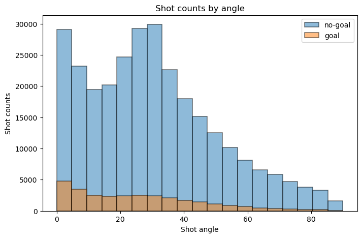
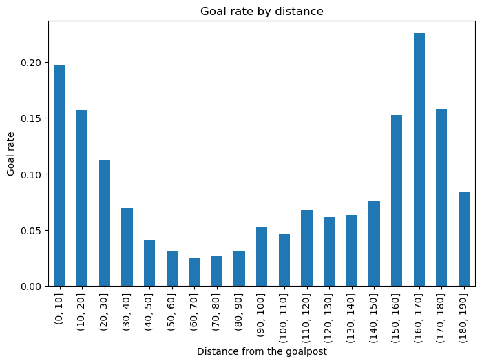
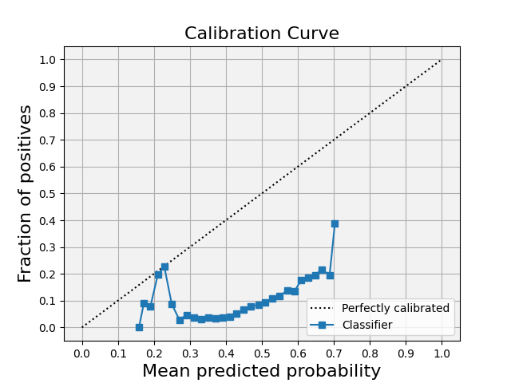
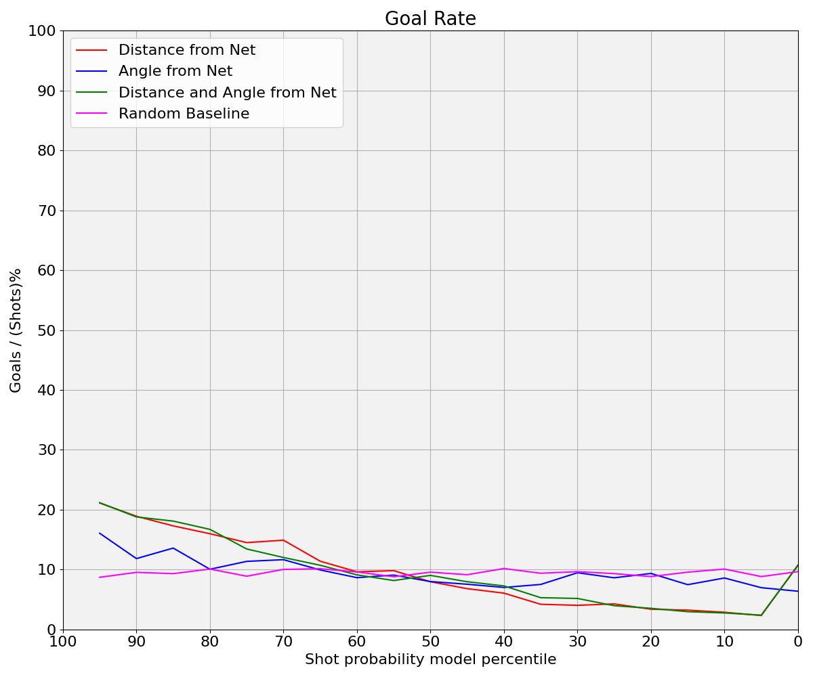

# <strong>DATA PATH RULES</strong>
## To run the code correctly, please follow the instructions below:  
Rename the data folder to 'IFT6758_Data' and place the folder under the main(father) path  
  

## <strong>1. Experiment Tracking</strong>

### See the following parts.

## <strong>2. Feature Engineering I</strong>

### In this milestone, we split the raw data into train, validation and test sets:

### <strong>Question 1</strong>: 

Here we have calculated shot_distance and shot_angle and added them as new columns to the dataframe. And set the number of bins to 20 for plot. 
As we can see from the chart, although the number of no-goals is significantly higher than the number of goals, the two roughly follow an approximate distribution.

From the image we can see that the distribution roughly shows a U-shaped distribution with a low centre and two high ends. From the distribution we can guess that due to the large number of people gathered in the middle of the field during the game, it might be difficult to score from this distance, so most of the time the athletes did not perform the shooting action at this distance.

From the image we can see that shot counts show a decreasing trend with increasing angle. This indicates that most of the athletes tend to shoot from the front rather than from a more oblique angle.

From the image we can see that the shot counts have a significant density when the distance is far and the angle is close to 0. From this we can guess that many fast counterattacks (i.e. shots on the opponent's net in front of their own net) took place in the actual match.

### <strong>Question 2</strong>:

In this question instead of histograms, we chose bar charts for plotting. Because for continuous data, the probability of goal at each distance point (or angle point) will only be 1 or 0, the data we get in this case is not meaningful for any study. So we divided the distances and angles into 20 intervals and calculated the goal rate for each interval separately. The results are as follows:

From the image we can see that the distribution roughly shows a U-shaped distribution with a low centre and two high ends. The higher goal rate at closer distances is very understandable, and the lower goal-scoring rate at mid-distance somehow confirms our suspicion in question 1 that there is a large number of players gathered in the middle of the court, which makes it less easy to goal. The high goal rate at longer distances may be due to quick counter-attacks, where the opposing players have no time to react.

From the image we can see that the goal rate is higher when the angle is close to 0, while the other angles have roughly the same goal rate. This is also aligned with our common sense: shots from the front are more likely to goal.

### <strong>Question 3</strong>:

From the image we can see that the empty net stays at a very low level no matter what the shot distance is. This shows that in most cases the goalkeepers of both teams stay in front of their own net. 
Our domain knowledge is that "it is incredibly rare to score a non-empty net goal on the opposing team from within your defensive zone". But from the image we can see that there are very many non-empty net goals scored from long distance, which is against our domain knowledge and suggests that there may be anomalous data.

## <strong>3. Baseline Models</strong>

### <strong>Question 1</strong>:

<<<<<<< HEAD
The accuracy score of our model on the validation set is approximately 0.906, which means that it correctly predicted about 90.6% of the samples in the validation set.Accuracy is a useful metric when the classes are balanced, but it can be misleading when the class distribution is inbalance.I calculate it by comparing the model's predictions against the actual outcomes in the validation set. It's the number of correct predictions divided by the total number of predictions. 
in summary even  though the accuracy is high in the model but the classifier doesnt work well as our classes are inbalance. this might be due to the feutures that we chosed. goals are not correlated with the distance of the shot from net.

### <strong>Question 2</strong>: 

The first plot labeled "ROC curve for distance"shows the performance of my classifier in terms of the trade-off between the true positive rate and false positive rate. The area under the curve (AUC) is 0.53, which is slightly better than random guessing (AUC of 0.5). However, an AUC this close to 0.5 indicates that the model does not have a strong discriminatory ability.

The goal rate (#goals / (#no_goals + #goals)) as a function of the shot probability model percentile, i.e. if a value is the 70th percentile, it is above 70% of the data. 

third plot is cumulative percentage of goals, which is an empirical cumulative distribution function (ECDF) of the predicted probabilities for the goals. This can help understand the concentration of goals within certain predicted probability ranges.

 is a calibration curve, it show how well the predicted probabilities of the goals are calibrated. The ideal calibration curve would be a straight line at a 45-degree angle. Deviations from this line indicate over- or under-confidence in predictions. if the model is perfectly calibrated, the predicted probabilities of the positive class would match the actual frequency of the positive class.
### <strong>Question 3</strong>:

The models trained on angle, distance, and both features outperform the random baseline, as indicated by their AUC values being above 0.50, which is the AUC of a random classifier. However, all AUC values are quite close to the random baseline, suggesting only a marginal improvement over random guessing.
The model that includes both distance and angle as features performs the best, with an AUC of 0.60, indicating that combining features can provide a better prediction capability than using them individually.

This plot shows the goal rates at different shot probability model percentiles. The model trained on both features appears to maintain a consistent advantage over the single-feature models, though there is considerable variability in the goal rates.
All models, including the random baseline, demonstrate a lack of consistency, with goal rates fluctuating across the percentiles, which might indicate that the models are not very reliable predictors of goal probability.

The cumulative percentage of goals plot shows how well the models rank the shots by their probability of being a goal. Ideally, a higher proportion of actual goals would be found at higher predicted probabilities.
The model using both features again seems to perform better than the others, as it ranks more goals at higher probability percentiles, but the improvement over the single-feature models is not dramatic.

A well-calibrated model should have points that lie close to the "perfectly calibrated" line, where the predicted probabilities match the observed frequencies.
The calibration plot shows that all models, including the random baseline, are poorly calibrated, with most predictions clustered at the low probability end and not aligning with the diagonal line representing perfect calibration.
Overall, these results suggest that while the logistic regression model benefits from the inclusion of both distance and angle features, the overall predictive performance is only marginally better than random. The models appear to be poorly calibrated, which could result from an overfit to the training data, inadequate feature selection, or inherent unpredictability in the data. To improve the model, it may be necessary to explore more complex models, additional features, or different data preprocessing techniques.
### <strong>Question 4</strong>:
distance: https://www.comet.com/api/registry/model/item/download?modelItemId=NNWWTsrccam0dBkAcTD6tY43f
angle: https://www.comet.com/api/registry/model/item/download?modelItemId=mtVkSF73afL3TmKZM9VDKXqbP
distance-angle: https://www.comet.com/api/registry/model/item/download?modelItemId=RmkwRg4fFcR9QHAXOde2xh3G6
=======
### <strong>Question 2</strong>:

### <strong>Question 3</strong>:

### <strong>Question 4</strong>:

>>>>>>> main
## <strong>4. Feature Engineering II</strong>

### <strong>Question 1</strong>:

### <strong>Question 2</strong>:

### <strong>Question 3</strong>:

### <strong>Question 4</strong>:

### <strong>Question 5</strong>:

## <strong>5. Advanced Models</strong>

### <strong>Question 1</strong>:

### <strong>Question 2</strong>:

### <strong>Question 3</strong>:

## <strong>6. Give it your best shot!</strong>

### <strong>Question 1</strong>:

### <strong>Question 2</strong>:

## <strong>7. Evaluate on test set</strong>

### <strong>Question 1</strong>:
<<<<<<< HEAD

Figure 7.1.1 ROC curves for models developed in this milestone, tested on the 2020/21 regular season dataset.
The HP-XGB and tomek-XGB models have the highest AUC scores, indicating they perform best at distinguishing between the two classes.
LR_D has the lowest AUC, which suggests it struggles compared to the other models.

Figure 7.1.2 Goal rate (# goals / (#no_goals + # goals)) as a function of shot probability model percentile for models developed in this milestone, tested on the 2020/21 regular season dataset.
All models show a declining trend as the shot probability percentile decreases, which is expected.
There is significant overlap and crossing-over of lines, suggesting the models might have varying levels of calibration and discrimination at different probability thresholds.

Figure 7.1.3 Cumulative proportion of goals as a function of the shot probability model percentile for models developed in this milestone, tested on the 2020/21 regular season dataset.
The curves are generally sigmoidal, which is typical for cumulative distribution functions.
There's less separation between the models here, suggesting they may have similar discrimination capabilities overall. 

Figure 7.1.4 Calibration curve for models developed in this milestone, tested on the 2020/21 regular season dataset.
Most models appear to have segments where they are well-calibrated, but there are deviations, particularly in the mid-probability ranges.
Some models show extreme values (spikes in the plot), which could indicate overfitting to the training data or issues with model stability.
### <strong>Question 2</strong>:

Figure 7.2.1 ROC curves for models developed in this milestone, tested on 2020/21 playoff games. 
The ROC curves show that the models have varying degrees of discriminative power, with the HP-XGB and tomek-XGB models performing the best as indicated by their AUC scores. The LR_D model performs the least effectively. A decrease in AUC compared to the validation set could indicate overfitting or that the model has not generalized well to unseen data. If the AUCs are comparable, it suggests that the models have generalized well.

Figure 7.2.2 Goal rate (# goals / (#no_goals + # goals)) as a function of shot probability model percentile for models developed in this milestone, tested on 2020/21 playoff games.
The goal rate chart should ideally show a higher rate for shots predicted to be goals. If the lines are relatively flat or not monotonically decreasing, it may indicate that the models are not well-calibrated or that they are not effectively distinguishing between shots that are goals and those that are not. A major divergence in performance on this chart compared to the validation set could indicate that the models are not robust to changes in data distribution.

Figure 7.2.3 Cumulative proportion of goals as a function of the shot probability model percentile for models developed in this milestone, tested on 2020/21 playoff games.
This chart indicates the proportion of actual goals captured by the model as the threshold is varied. A perfect model would capture all goals at the 100th percentile. The curves suggest that all models capture a substantial proportion of goals, but none is perfect. A steeper curve indicates better performance. If the models capture a similar proportion of goals in the test set as in the validation set, it would suggest that they are generalizing well.

Figure 7.2.4 Calibration curve for models developed in this milestone, tested on ß2020/21 playoff games.
Calibration plots show the fraction of positives that are correctly identified across different predicted probabilities. A well-calibrated model will lie close to the diagonal line. Large deviations from the diagonal, especially in the mid-probability range, suggest that the predicted probabilities are not representative of the true likelihood of an event. If the calibration is worse on the test set than on the validation set, it could suggest that the model is not generalizing well to new data.
=======

### <strong>Question 2</strong>:
>>>>>>> main
