# <strong>DATA PATH RULES</strong>
## To run the code correctly, please follow the instructions below:  
Rename the data folder to 'IFT6758_Data' and place the folder under the main(father) path  
  

## <strong>1. Experiment Tracking</strong>

### See the following parts.

## <strong>2. Feature Engineering I</strong>

### In this milestone, we split the raw data into train, validation and test sets:

### <strong>Question 1</strong>: 

Here we have calculated shot_distance and shot_angle and added them as new columns to the dataframe. And set the number of bins to 20 for plot. 
As we can see from the chart, although the number of no-goals is significantly higher than the number of goals, the two roughly follow an approximate distribution.

From the graph we can see that shot counts are high at [0,50] but decrease when the distance increases. This is very understandable, because the closer the distance, the easier it is to goal. But the shot counts are also lower at [0,10], due to the fact that it's too close to the goalpost, and has probably been intercepted by an opposing player before that.

From the image we can see that shot counts show a decreasing trend with increasing angle. This indicates that most of the athletes tend to shoot from the front rather than from a more oblique angle. This is also in line with our common sense: more oblique angles tend to be harder to get a goal.

From the image we can see that the shot counts have a significant density when the distance is close and the angle is close to 0. This is also in line with common sense: shots tend to be concentrated closer to the front of the net.

### <strong>Question 2</strong>:

In this question instead of histograms, we chose bar charts for plotting. Because for continuous data, the probability of goal at each distance point (or angle point) will only be 1 or 0, the data we get in this case is not meaningful for any study. So we divided the distances and angles into 20 intervals and calculated the goal rate for each interval separately. The results are as follows:

We can see from the graph that the distribution is roughly "U" shaped with a low centre and high ends. The higher goal rate from close range is well understood, whereas the lower goal rate from mid-range may be due to a large number of players congregating in the centre of the pitch, which makes scoring goals less easy. The high rate of goals from further distances may be due to quick counter-attacks where the opposing players have no time to react.

From the image we can see that the goal rate is higher when the angle is close to 0, while the other angles have roughly the same goal rate. This is also aligned with our common sense: shots from the front are more likely to goal.

### <strong>Question 3</strong>:

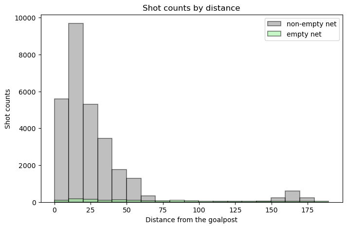

From the image we can see that the empty net stays at a very low level no matter what the shot distance is. This shows that in most cases the goalkeepers of both teams stay in front of their own net. 
According to our domain knowledge, "it is very rare to score a non-open goal to an opposing team in their own defensive zone". However, we can see from the picture that there are some non-empty long range goals in the [150,175] zone, which contradicts our domain knowledge and suggests that there may be anomalous data.

## <strong>3. Baseline Models</strong>

### <strong>Question 1</strong>:
 
The accuracy score of our model on the validation set is approximately 0.906, which means that it correctly predicted about 90.6% of the samples in the validation set.Accuracy is a useful metric when the classes are balanced, but it can be misleading when the class distribution is inbalance.I calculate it by comparing the model's predictions against the actual outcomes in the validation set. It's the number of correct predictions divided by the total number of predictions. 
in summary even  though the accuracy is high in the model but the classifier doesnt work well as our classes are inbalance. this might be due to the feutures that we chosed. goals are not correlated with the distance of the shot from net. 

### <strong>Question 2</strong>: 
 
The first plot labeled "ROC curve for distance"shows the performance of my classifier in terms of the trade-off between the true positive rate and false positive rate. The area under the curve (AUC) is 0.53, which is slightly better than random guessing (AUC of 0.5). However, an AUC this close to 0.5 indicates that the model does not have a strong discriminatory ability. 
 
The goal rate (#goals / (#no_goals + #goals)) as a function of the shot probability model percentile, i.e. if a value is the 70th percentile, it is above 70% of the data.  
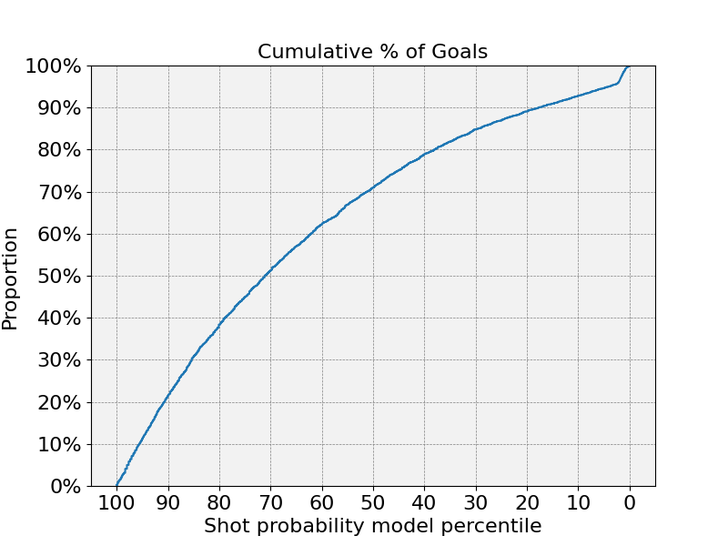 
third plot is cumulative percentage of goals, which is an empirical cumulative distribution function (ECDF) of the predicted probabilities for the goals. This can help understand the concentration of goals within certain predicted probability ranges. 
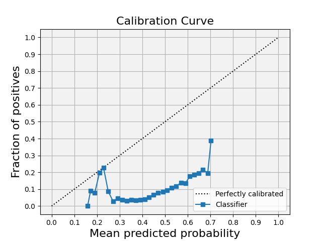 
 is a calibration curve, it show how well the predicted probabilities of the goals are calibrated. The ideal calibration curve would be a straight line at a 45-degree angle. Deviations from this line indicate over- or under-confidence in predictions. if the model is perfectly calibrated, the predicted probabilities of the positive class would match the actual frequency of the positive class.
### <strong>Question 3</strong>:
 
models trained using distance from net (distance from net alone or both distance and angle) performed better than those trained using angle from net alone. Models trained on distance tend more towards the top left corner on the ROC plot than do models using angle only, and they have an AUC of 0.65 compared to an AUC of 0.51 for angle. Combining distance and angle adds no increased AUC or curve, suggesting that distance is the defining feature. Indeed, the model using angle only has an AUC matching that of the random baseline. The fact that the ROC curves for angle and random baseline are different despite them having the same AUC values highlights the need to look at data in different ways - in this case, it suggests that the model trained on angle is not simply choosing at random. 
 
This plot shows the goal rates at different shot probability model percentiles. Plotting goal rate as a function of shot probability model percentile gives an indication of whether the model favours shots of a certain probability and hints at what the model thinks is a high-quality shot. The random baseline (Figure 3.3.2), as a straight horizonal line at 10% on the goal rate, gives equal weight to goals of all probabilities. The logistic regression model trained on angle gives a higher goal rate to shots around the 50th model percentile and underweights (assigns a lower goal rate to) shots with high or low model percentiles. Similar to the ROC curves, we see that models using distance from net alone and distance + angle have near-identical curves. Both of these models assign a higher-than-baseline goal rate to shots in the upper model percentile (~ > 70 %) and lower-than-baseline to shots in the lower model percentile (except for shots < 5 %), suggesting that they attribute a higher quality to shots in the upper model percentile.
 
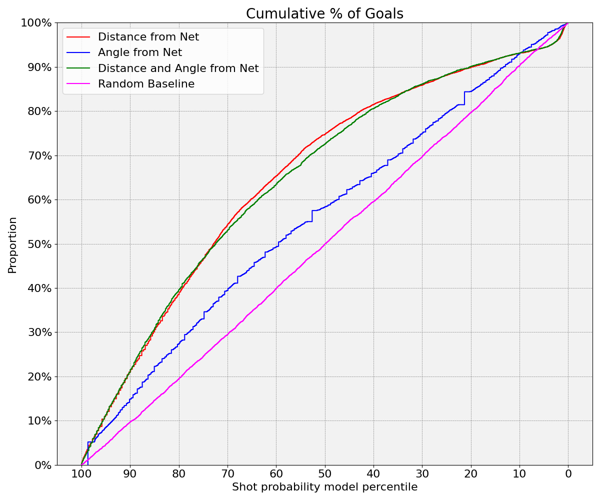 
The cumulative percentage of goals plot shows how well the models rank the shots by their probability of being a goal. Ideally, a higher proportion of actual goals would be found at higher predicted probabilities.
The model using both features again seems to perform better than the others, as it ranks more goals at higher probability percentiles, but the improvement over the single-feature models is not dramatic. 
 
A well-calibrated model should have points that lie close to the "perfectly calibrated" line, where the predicted probabilities match the observed frequencies.
The calibration plot shows that Distance, Angle and Distance-angle are calibrated while the random baseline is poorly calibrated, with most predictions clustered at the low probability end and not aligning with the diagonal line representing perfect calibration.distance-angle is passing the perfect line to the point that we can consider over fitting.but we can assume that feature selectioon play a important role in model calibration.
To improve the model, it may be necessary to explore more complex models, additional features, or different data preprocessing techniques.
### <strong>Question 4</strong>:
 Logistic Regression Distance: <https://www.comet.com/ift6758b-project-b10/nhl-project-b10/976e951b6afd44de9aef1a9524fcf6f2?experiment-tab=panels&showOutliers=true&smoothing=0&xAxis=wall> 
 Logistic Regression Angle: <https://www.comet.com/ift6758b-project-b10/nhl-project-b10/f64365671ef04d90b10997ee382232ee?experiment-tab=panels&showOutliers=true&smoothing=0&xAxis=wall> 
 Logistic Regression Distance-Angle: <https://www.comet.com/ift6758b-project-b10/nhl-project-b10/5f068b961b7e4ac48bfd3010e0697582?experiment-tab=panels&showOutliers=true&smoothing=0&xAxis=wall> 
## <strong>4. Feature Engineering II</strong>

The following are feature names outputted by `feature_eng2_cleaned` (i.e., our feature engineering function provided in `Milestone2/features/feature_eng2.py`) with their respective descriptions:

 <strong>gameSeconds (`int`):</strong> value of number of seconds into the game   
 <strong>period (`int`):</strong> value of the period number (ex: `period = 3` for P-3)  
 <strong>x_coordinate(`float`):</strong> x coordinate of the event in feet  
 <strong>y_coordinate (`float`):</strong> y coordinate of the event in feet   
 <strong>shotDistance (`float`):</strong> distance between the event and the net   
 <strong>shotAngle (`float`):</strong> acute angle (in degrees) between the event and the goal with respect to the x-axis   
 <strong>shotType (`str`):</strong> type of shot (ex: Wrist Shot, Slap Shot)   
 <strong>LastEventType (`str`):</strong> previous event type (ex: Shot, Goal)   
 <strong>Last_x_coordinate (`float`):</strong> x coordinate of the previous event in feet  
 <strong>Last_y_coordinate (`float`):</strong> y coordinate of the previous event in feet  
 <strong>timeFromLastEvent (`float`):</strong> time interval in seconds between the current and previous event   
 <strong>DistanceLastEvent (`float`):</strong> distance in feet between the current and previous event   
 <strong>Rebound (`bool`):</strong> boolean value for if the shot was a rebound (`True/1`) or not (`False/0`)  
 <strong>changeShotAngle (`bool`):</strong> if `Rebound = True/1`, change in the angle of the puck before and after the rebound   
 <strong>speed (`float`):</strong> speed between current and previous event corresponding to DistanceLastEvent/timeFromLastEvent in ft/s  
 <strong>time_since_pp (`float`):</strong> BONUS feature corresponding to the time in seconds since the currently active power-play started  
<strong>no_players_home (`int`):</strong> BONUS feature corresponding to the number of home team non-goalie players current on the ice  
 <strong>no_players_away (`int`):</strong> BONUS feature corresponding to the number of away team non-goalie players current on the ice  
 <strong>is_goal (`bool`):</strong> boolean value where 0 corresponds to a shot (<strong>not</strong> goal), while 1 corresponds to a goal.  
 The following features were added by personal initiative (as part of part 6): 
 <strong>home_pts (`int`):</strong> current number of points scored by the home team during the game (i.e., home score)  
 <strong>away_pts (`int`):</strong> current number of points scored by the away team during the game (i.e., away score)  
 <strong>diff_pts (`int`):</strong> difference between the current number of points scored by the home and away teams  

## <strong>4. Feature Engineering II(bonus)</strong>

We've computed the time (s) since the power-play (PP) started for all penalties (both teams included), for home team penalties, and for away team penalties as a function of period time (in seconds). See the following plots below for the game ID 2016020031 of regular season in 2016 during period 3. Naturally, the y-value (time since PP start) increases as the periodTime increases. Also, the combination of the time since PP start for home team penalties and away team penalties also corresponds to the plot for the time since PP started for all penalties (both teams included). 

Moreover, we've determined the number of friendly non-goalie (home team) skaters on the ice as well as the number of opposing non-goalie skaters (away team) on the ice as a function of period time (s). The function generating the data plotted takes as input the game data `pd.Dataframe` as well as the period number `select_period`. See the following plots below for the game ID 2016020031 of regular season in 2016 during period 3:

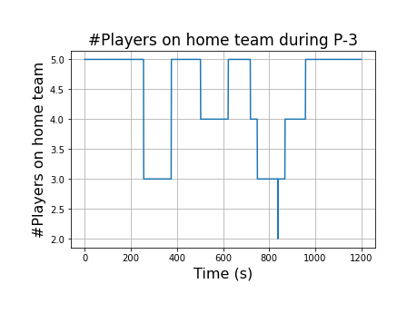

Comet link for DataFrame: <https://www.comet.com/ift6758b-project-b10/nhl-project-b10/ad9395a05a6d42a4ab5c1d25595692f9?experiment-tab=panels&showOutliers=true&smoothing=0&xAxis=step>
## <strong>5. Advanced Models</strong>

### <strong>Question 1</strong>: 
The following 4 figures were generated after training the XGBoost classifier only shot distance, only shot angle and shot distance and angle together:
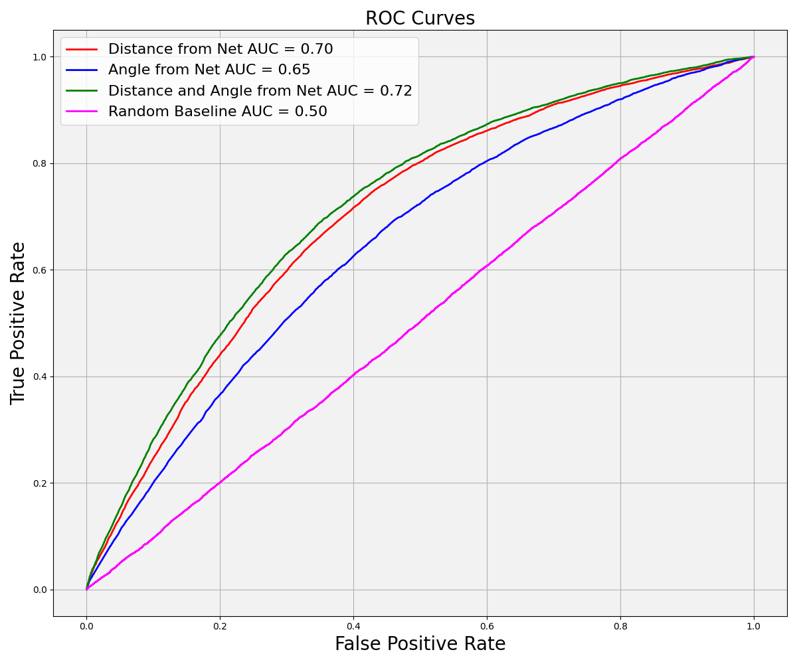
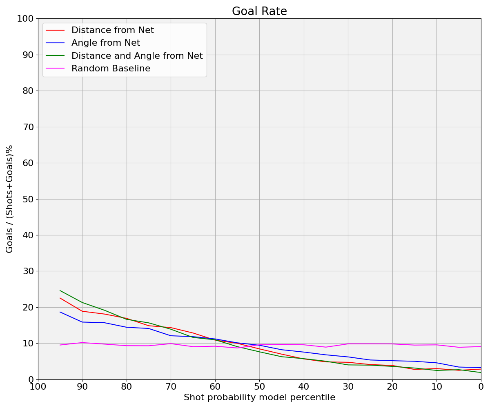

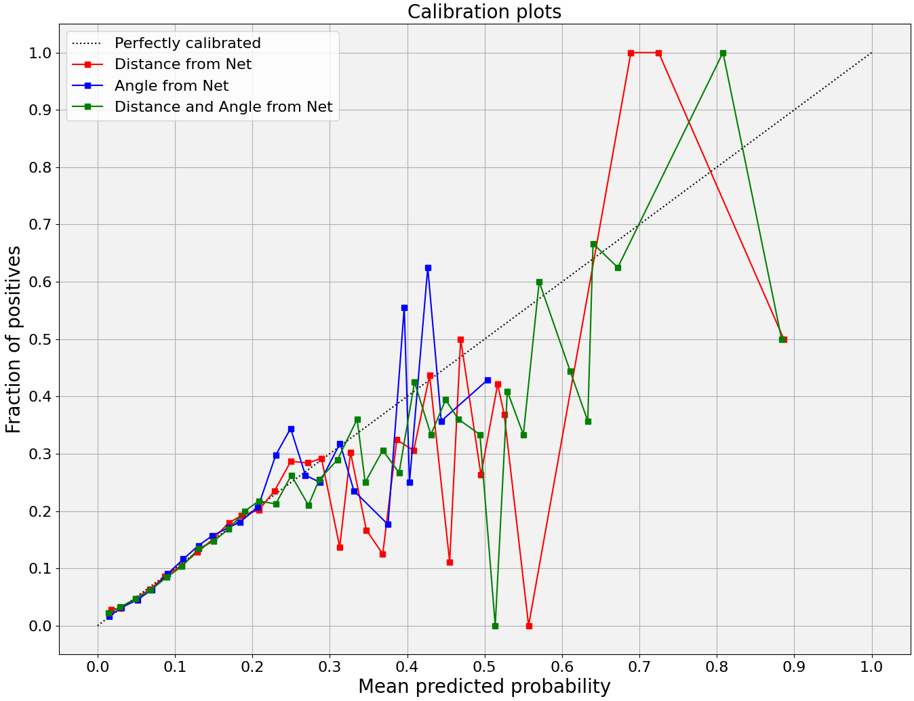

For this experiment, the features listed in feature engineering 2 were used. First, the rows with `NaN` or `inf` values were dropped. Then, the data was split into training and validation sets in the ratio 70% to 30%.  
The data was found to be heavily imbalanced with `class 0` (no goal) comprising 91% of the data and `class 1` (goal) comprising 9% of the data. Hence, the split was stratified to prevent over-representation of the majority class in either of the training or validation sets. 
As compared to Logistic Regression, the accuracy obtained by XGBoost is significantly higher but Logistic Regression scores well on metrics like F1 score, Precision, Recall which are important in case of an imbalanced dataset. 
Moreover, the area under the ROC curve for XGBoost is higher as compared to Logistic Regression baseline i.e. XGBoost is more accurate at predicting whether an event is a goal or not. Furthermore, the calibration curves denote that the predicted probabilities are very narrow for Logistic Regression while they are spread 
out in the case of XGBoost. This may indicate that Logistic Regression is mostly able to predict the lower probabilities i.e. events that could be no goals while the spread in the case of XGBoost indicates that it can predict if an event is a goal with higher probability.   
Comet experiment link: <https://www.comet.com/ift6758b-project-b10/nhl-project-b10/ed9f2771ab0649a6bb050a3af5949dfc?experiment-tab=panels&showOutliers=true&smoothing=0&xAxis=wall>

### <strong>Question 2</strong>:
For this experiment, the Python library `optuna` was used to find the optimal set of hyperparameter values. The setup aimed to find the optimal hyperparameter values from `booster` (type of boosting model that is used), `lambda` (L2 regularization term on weights), `alpha` (L1 regularization term on weights).  
Based on the value of `booster`, a number of other hyperparameters are used such as: 
For `booster` value `gbtree` or `dart`
* `max_depth`: Maximum depth of the tree. Value is selected as an integer from 1 to 9 to avoid overfitting.
* `eta`: Step size shrinkage used in update to prevent overfitting. Value is sampled from log domain between 1e-8 and 1.
* `gamma`: Minimum loss reduction required to make a further partition on a leaf node of the tree. Value is sampled from log domain between 1e-8 and 1.
* `grow_policy`: Tree construction algorithm used in training. Values can be "depthwise" or "lossguide".

For `booster` value `dart`
* `sample_type`: Type of sampling algorithm used in dropout. Values can be "uniform" or "weighted".
* `normalize_type`: Type of normalization algorithm used in dropout. Values can be "tree" or "forest".
* `rate_drop`: Dropout rate. Value is sampled from log domain between 1e-8 and 1.0.
* `skip_drop`: Probability of skipping the dropout during a boosting iteration. Value is sampled from log domain between 1e-8 and 1.

Apart from the above hyperparameters, `XGBoostPruningCallback` was used for pruning based on validation AUC for early-stopping unpromising trials. 
The following curves depict the hyperparameter selection process and the most important hyperparameters:
* `History Plot`: In this plot the y-axis shows the accuracy achieved by different trials while the x-axis shows the trial number. Each of the points on the graph corresponds to a trial and the line connects the points with the best performance till that iteration. The eventual flattening or convergence of the line denotes that optimum values are being reached at. The history plot can help us to see which hyperparameter configurations perform better or worse.
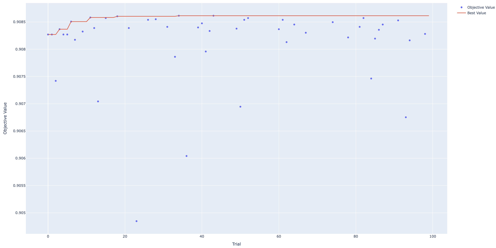
* `Importance Plot`: This plot visualizes the importance of each hyperparameter in the optimization process. The x-axis represents the importance score for a feature while the y-axis represents the hyperparameter names. The relative values of the importance scores help us to understand which hyperparameters contribute more to the optimization process. 

After optimizing the hyperparameters, the following graphs were generated:

The hyperparameter tuned XGBoost performs a little better than the XGBoost baseline model as the F1, Precision and Recall scores are higher for the hyperparameter tuned model. 
Moreover, there is a very minute difference in the area under the ROC curve between hyperparameter tuned XGBoost and XGBoost baseline which indicates that both the models predict an event as a goal or not roughly the same number of times. 
Furthermore, the calibration plots of both the models are equally spread and display the same characteristic and both models can equally predict with higher probability if a shot is a goal.  
Comet experiment link: <https://www.comet.com/ift6758b-project-b10/nhl-project-b10/d952e0f5e23d4753bfdebb81896ad354?experiment-tab=panels&showOutliers=true&smoothing=0&xAxis=wall>

### <strong>Question 3</strong>:
For this experiment, we relied on the following feature selection strategies:
* `VarianceThreshold`: In this technique, we filter out all the features with low variance under the assumption that features with low variance do not contain too much information. Underlying principle is that if a feature varies very little across the samples, then it might not help the model to distinguish between different classes. We provided the threshold as `0.8 * (1-0.8)` and all the features with variance lower than this were removed.
* `SelectKBest`: This is a feature selection strategy in scikit-learn which selects the top k features based on the provided scoring metric. We provided the `mutual_info_classif` (Mutual Information Classifier) as the scoring function, which measures the dependency between a pair of random variables.
* `ExtraTreesClassifier`: In this technique, we train the `ExtraTreesClassifier` on our training data which assigns each feature a score indicative of the feature's contribution in accurate predictions. We then use `SelectFromModel` from scikit-learn to select the best features based on the scores.

For the above 3 techniques, we use cross-validation with 10 folds and in each fold we select the most important features. We then train an XGBoost classifier on these features and calculate the F1 score (since dataset is imbalanced) of each fold. Post that we average out the F1 scores to get a reliable estimate of the model's predictive performance. 
Following the above process, the highest F1 score was found to be in the case of `ExtraTreesClassifier` and after performing feature selection with `ExtraTreesClassifier`, the features `gameSeconds`, `x_coordinate`, `y_coordinate`, `shotDistance`,
       `shotAngle`, `Last_x_coordinate`, `Last_y_coordinate`,
       `timeFromLastEvent`, `DistanceLastEvent`, `changeShotAngle`, `speed` were found to be optimal. 
To verify the optimal feature set, the following `SHAP` plots were used to see the feature importances:

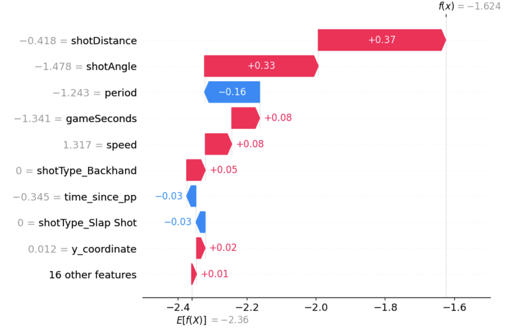

The following curves were obtained after training the hyperparameter tuned XGBoost model on the above obtained optimal set of features:

The XGBoost model after feature selection performs a little better than the XGBoost baseline model as the F1, Precision and Recall scores are higher for the model trained after feature selection. 
Moreover, there is a very minute difference in the area under the ROC curve between XGBoost with feature selection and XGBoost baseline which indicates that both the models predict an event as a goal or not roughly the same number of times. 
Furthermore, the calibration plots of both the models are equally spread and display the same characteristic and both models can equally predict with higher probability if a shot is a goal.  
Comet experiment link: <https://www.comet.com/ift6758b-project-b10/nhl-project-b10/003cfd6101b74b0cb01539faea73dc67?experiment-tab=panels&showOutliers=true&smoothing=0&xAxis=wall>

## <strong>6. Give it your best shot!</strong>

### <strong>Question 1</strong>: 
We trained ADABoost with 1 estimator preceded by a Random Forest Classifier for feature selection. We used all the features from Feature Engineering 2 along with the features that we created from our personal initiative. After feature selection,  we employed weight sampling to account for the heavily imbalanced dataset (the goal/shot ratio was 10%/90%, which is heavily imbalanced). We trained this model with a `max_depth` of 1,3, and 10, where an inrease in `max_depth` was associated with an increase in all performance metrics.  
Since there was an imbalance between the classes, we also tried to use over and undersampling techniques to generate/eliminate data points. We used the following techniques implemented in Python package `imblearn`:
* `Tomek Links`: Tomek links are generated by pairs of instances of different classes that are close to each other. The majority class instances are then removed to help enhance the decision boundary.
* `SMOTE`: SMOTE Oversamples the minority class by generating by identifying its k-nearest neighbours and generates synthetic data points along the line segments connecting the instance to its neighbors.
* `SMOTETomek`: SMOTETomek generates minority class instances using SMOTE and removes majority class instances using Tomek Links.

The following curves were obtained after performing all the experiments listed above:
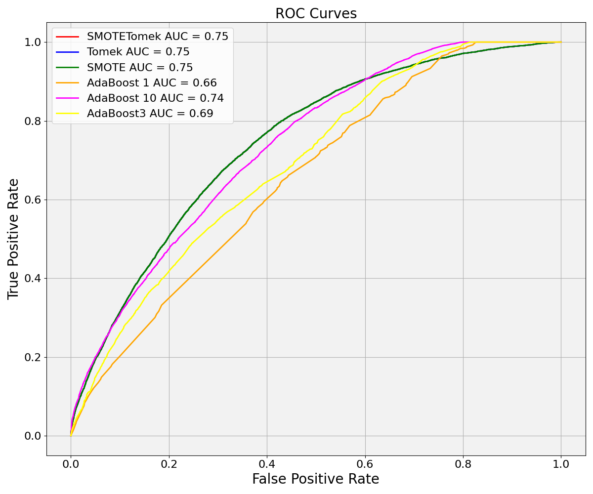
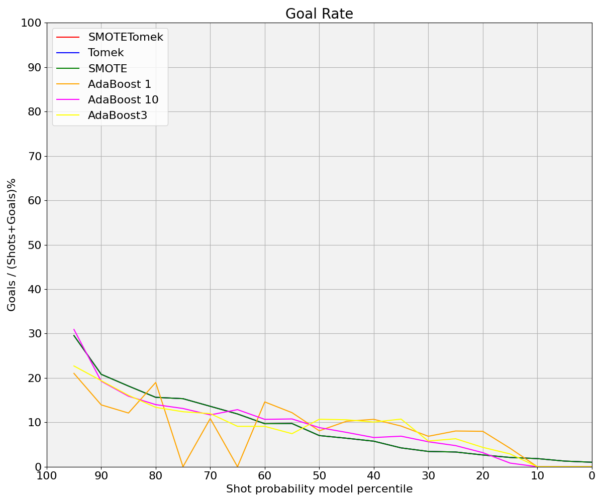
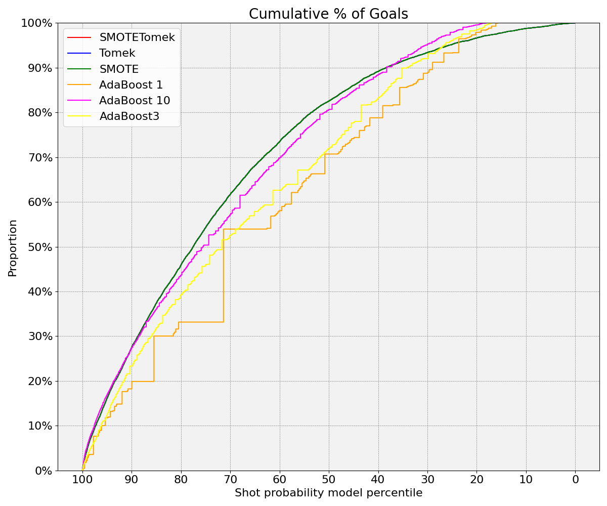

<strong>Note:</strong> The curves for `SMOTETomek`, `Tomek` and `SMOTE` are overlapping.  
We consider SMOTETomek as our best model as it had the highest area under ROC curve (0.75), had a reasonable F1 score (15.8) and its calibration plot had the least amount of vertical deviation (that is, it was closest to a perfectly calibrated classifier), while maintaining the same spread in probabilities.

### <strong>Question 2</strong>:
Comet experiment link for SMOTETomek: <https://www.comet.com/ift6758b-project-b10/nhl-project-b10/9e5adeeac7664562a2d5d9ee7940c752?experiment-tab=panels&showOutliers=true&smoothing=0&xAxis=wall>  
Comet experiment link for Tomek: <https://www.comet.com/ift6758b-project-b10/nhl-project-b10/03e1ba00a55243f3be18c6bd3c7f3e67?experiment-tab=panels&showOutliers=true&smoothing=0&xAxis=wall>  
Comet experiment link for SMOTE: <https://www.comet.com/ift6758b-project-b10/nhl-project-b10/9cf67e5d9248499182a9835d08024bbe?experiment-tab=panels&showOutliers=true&smoothing=0&xAxis=wall>  
Comet experiment link for Adaboost (max_depth=1): <https://www.comet.com/ift6758b-project-b10/nhl-project-b10/00194cb4469c492d876b63e4761bf657?experiment-tab=panels&showOutliers=true&smoothing=0&xAxis=wall>  
Comet experiment link for Adaboost (max_depth=3): <https://www.comet.com/ift6758b-project-b10/nhl-project-b10/8556a69d36a845f8b16e91ab19a32947?experiment-tab=panels&showOutliers=true&smoothing=0&xAxis=wall>  
Comet experiment link for Adaboost (max_depth=10): <https://www.comet.com/ift6758b-project-b10/nhl-project-b10/54fcd486ec094e6489648336c7d04cdb?experiment-tab=panels&showOutliers=true&smoothing=0&xAxis=wall>

## <strong>7. Evaluate on test set</strong>

### <strong>Question 1</strong>:
The figures for Regular season are as follows:
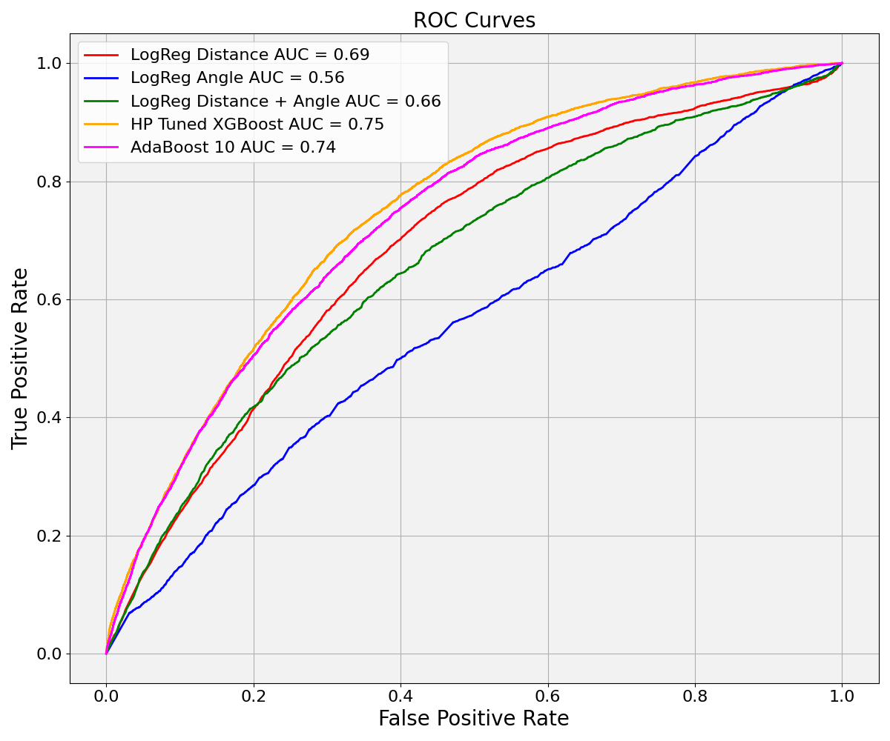
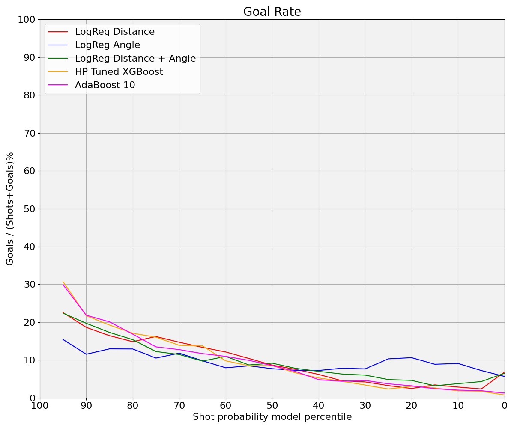
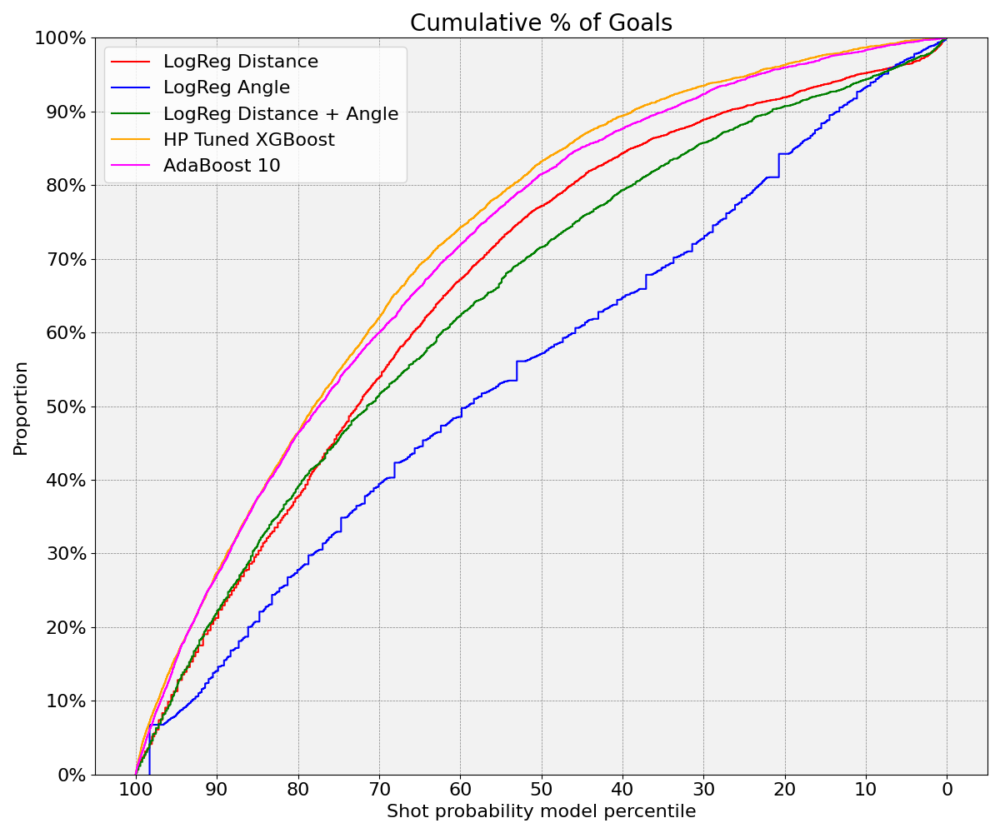

All models perform worse on the test set for regular season as compared to the validation set. The area under the ROC curves are more or less similar for all the classifiers 
but the large amount of vertical deviations in the calibration plot indicates a substantial discrepancy between the predicted probabilities and the actual outcomes at higher probability ranges. However, for lower probability ranges,
the calibration plot maintains the same behaviour. This can be due to the fact that since most of the events are no goals, the model correctly predicts the probabilities of those events. 
### <strong>Question 2</strong>:
The figures for Playoffs are as follows:
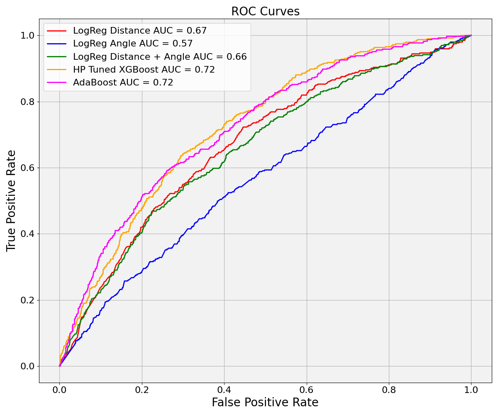
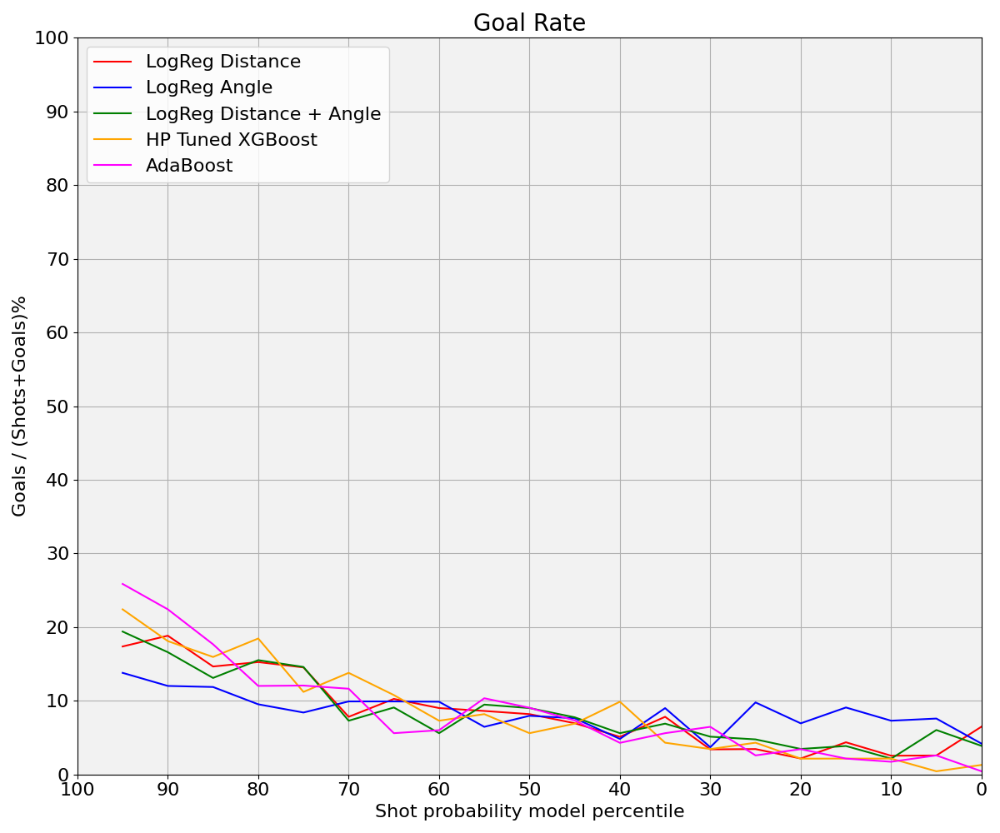

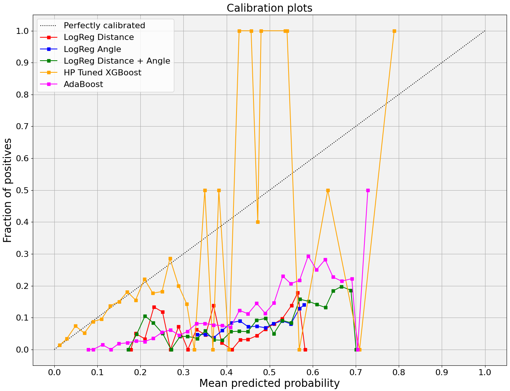

All models perform worse on the test set for playoff season as well, as compared to the validation sets. Moreover, their performance is a little worse than what it was for the regular season test set. 
This is evident from the fact that the area under ROC curves for the classifier is lesser as compared to the regular season test set. Furthermore, the calibration plots in this case also have significant 
vertical deviations indicating a substantial discrepancy between the predicted probabilities and the actual outcomes at higher probability ranges.
